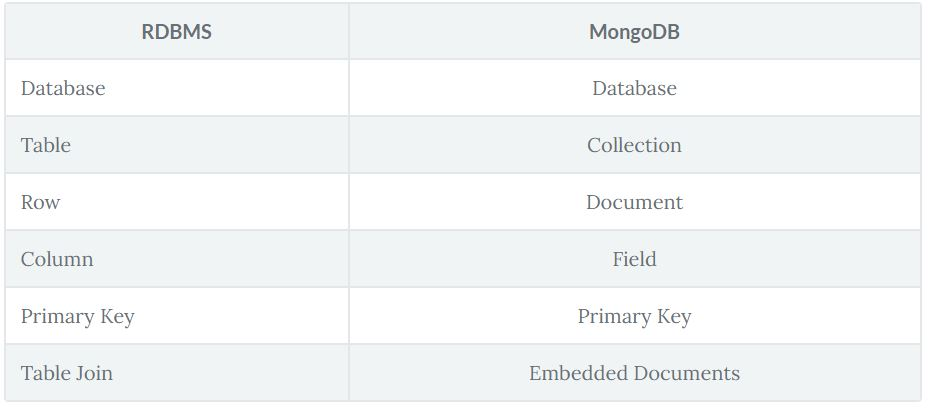

# MongoDB cheatsheet
By Toki

## Features
* **Open-source _NoSQL_ database** ---> Catch-all term for databases that generally aren’t relational and don’t have a query language like SQL 
* **Document-oriented** ---> Documents Are Just JSON-like Objects
* **Great for unstructured data**, especially when you have a lot of it

## Types of data you can store
* **Strings** 
* **Numbers**
* **Booleans**
* **Arrays**
* **Objects**
* **ObjectId**
* **ISODate**

## Installing

'''
[Click here to follow the manual instructions](https://dangphongvanthanh.wordpress.com/2017/06/12/add-mongos-bin-folder-to-the-path-environment-variable/)
'''

## Comparing MongoDB to RDBMS
SQL is relational and MongoDB is document-oriented.



## Starting the Shell
```
$ mongo
>
```
### Use or create a new database
```
> use reviews # Switches to use the database and creates it if doesn't exist when we write to it

> db # reviews
```

### Show list of commands
```
> help
db.help()       ...
...             ...
...             ...

> show dbs
test          0.078GB
reviews       0.078GB
```

## Login into a cluster

```
mongo "mongodb+srv://cluster0-qwc17.mongodb.net/test" --username TypeYourUsername
```
  
## Some basic commands
* Inserting a Document Into a Collection, if doesn't exist, one will be created
```
> db.YourCollectionName.insert(
  {.
   "name": "Toki",
   "another_field": "Yomi's"
  }
  )
WriteResult({ "nInserted": 1 })
```
* Drop collection
```
> db.YourCollectionName.drop()
```
* Find one arbitrary document
```
> db.YourCollectionName.findOne() # Random
```
```
> db.YourCollectionName.findOne({"name":"abc"}) # Finds one document by attribute
```
* Find all the documents in a collection
```
> db.YourCollectionName.find()
```
```
> db.YourCollectionName.find().pretty() # JSON Format
```
```
> db.YourCollectionName.find.().limit(NumberOfResults) # Show the first N documents that match
```
* Find an specific document with a query
```
> db.YourCollectionName.find( {"name": "Toki"} ) # Queries are field/value pairs
```
```
{
   "_id": ObjectId("559f07d741894edebdd8aa6d"),
   "name": "Toki",
   "another_field": "Yomi's"
 }
```
* Queries That Return Multiple Values
```
> db.YourCollectionName.find( {"another_field": "Yomi's"} ) # Queries are field/value pairs
```
```
{
   "_id": ObjectId("559f07d741894edebdd8aa6d"),
   "name": "Toki",
   "another_field": "Yomi's"
 }
 {
   "_id": ObjectId("559f07d712894edebdd8aa6d"),
   "name": "Caro",
   "another_field": "Yomi's"
 }
```
* Count documents
```
> db.YourCollectionName.find().count()
```
* Remove document
```
> db.YourCollectionName.remove() # Remove all collection's documents
```
```
> db.YourCollectionName.remove({"name":"abc"}) # Remove by criteria
```
* Sort data
```
> db.YourCollectionName.find().sort({"some_field": N}) # 1 for ascending, -1 for descending
```
* Updating documents
```
> db.YourCollectionName.update({"name":"abc"},{"age":25"}) # Replaces thw whole document
```
```
> db.YourCollectionName.update({"name":"abc"},{"$set":{"age":25}}) # Change certain attribute
```
```
> db.YourCollectionName.update({"name":"abc"},{"$unset":{"age":1}}) # unset attribute 
```
* Find and update
```
> db.YourCollectionName.findAndModify({query:{..},sort:{...},update:{...}})
```
* Embedded Documents
We embed documents simply by adding the document as a value for a given field.
```
{
"ratings": {"strength": 2, "flavor": 5}
}
```
* Aggregation
The aggregation framework allows for advanced computations. "Aggregate" is a fancy word for combining data
```
> db.potions.aggregate(
  [{"$group": {"_id": "$vendor_id"}}] # Field names that begin with a “$” are called "field paths” and are links to a feld in a document
)
```
```
# Returns result object containing the unique vendors in the inventory collection
{"_id": "Kettlecooked"},
{"_id": "Brewers"},
{"_id": "Leprechaun Inc"}
```
* Accumulators
Anything specified after the group key is considered an accumulator. Accumulators take a single expression and compute the expression for grouped documents.
```
> db.potions.aggregate([
  { "_id": "$vendor_id", "total": {"$sum": 1}}} # Will add 1 for each matching document
])
```
```
# Results total number of documents per vendor
{"_id": "Kettlecooked", "total": 2},
{"_id": "Brewers", "total": 1,},
{"_id": "Leprechaun Inc”, "total": 1}
```
* An integral example using $match
$match is just like a normal query and will only pass documents to the next stage if they meet the specified condition(s)
```
> db.potions.aggregate([
 {"$match": {"price": {"$lt": 15}}}, # Matching Potions Under $15
 {"$project":{"_id": false, "vendor_id": true, "grade": true}}, # Vendor and grade for each potion after the match stage
 {"$group": {"_id": "$vendor_id","avg_grade": {"$avg": "$grade"}}}, # Grouping Potions by Vendor
 {"$sort": {"avg_grade": -1}}, # Sorting Vendors by Average Grade
 {"$limit": 3} # Specify the number of documents to limit
])
```
```
# Agregation results
 {"_id": "Kettlecooked", "avg_grade": 99 },
 {"_id": "Leprechaun Inc", "avg_grade": 95 },
 {"_id": "Brewers", "avg_grade": 90 }
```

## Query and Projection Operators
* **Comparisson**
  * **$eq** Matches values that are equal to a specified value.
  * **$gt** Matches values that are greater than a specified value.
  * **$gte** Matches values that are greater than or equal to a specified value.
  * **$in** Matches any of the values specified in an array.
  * **$lt** Matches values that are less than a specified value.
  * **$lte** Matches values that are less than or equal to a specified value.
  * **$ne** Matches all values that are not equal to a specified value.
  * **$nin** Matches none of the values specified in an array.
  
* **Logical**
  * **$and** Joins query clauses with a logical AND returns all documents that match the conditions of both clauses.
  * **$not** Inverts the effect of a query expression and returns documents that do not match the query expression.
  * **$nor** Joins query clauses with a logical NOR returns all documents that fail to match both clauses.
  * **$or** Joins query clauses with a logical OR returns all documents that match the conditions of either clause.
  
* **Element**
  * **$exists** Matches documents that have the specified field.
  * **$type** Selects documents if a field is of the specified type.
  
* **Array**
  * **$all**	Matches arrays that contain all elements specified in the query.
  * **$elemMatch** Selects documents if element in the array field matches all the specified $elemMatch conditions.
  * **$size** Selects documents if the array field is a specified size.

## References
[Mongo Manual Reference](https://docs.mongodb.com/manual/reference/)
[The Magical Marvels of MongoDB](https://www.pluralsight.com/courses/code-school-the-magical-marvels-of-mongodb)
  
