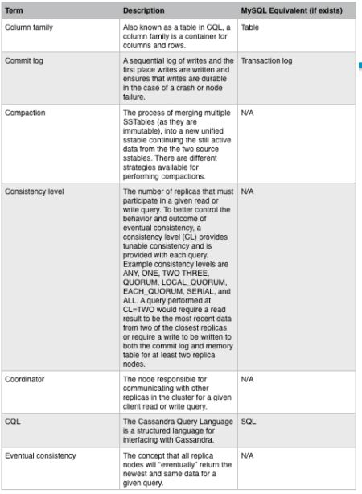
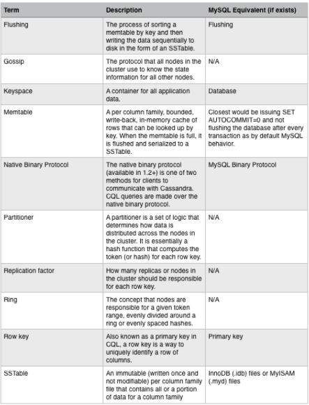
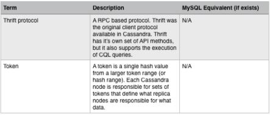

# Apache Cassandra Cheatsheet
## Table of Contents
- [What is Cassandra?](#what-is-cassandra)
- [History](#history)
- [Features](#features)
- [Terminology](#terminology)
- [Data definition](#data-definition)
- [Data manipulation](#data-manipulation)
- [References](#references)

## What is Cassandra?
<p align="center">
  
  
> “Apache Cassandra is the right choice when you need scalability and high availability without compromising performance. Linear scalability and proven fault-tolerance on commodity hardware or cloud infrastructure make it the perfect platform for mission-critical data. Cassandra's support for replicating across multiple datacenters is best-in-class, providing lower latency for your users and the peace of mind of knowing that you can survive regional outages.”

## History
* Apache Cassandra was developed at Facebook to power their Inbox Search feature by Avinash Lakshman (one of the authors of Amazon's Dynamo) and Prashant Malik. 
* It was released as an open source project on Google code in July 2008. 
* In March 2009, it became an Apache Incubator project.On February 17, 2010 it graduated to a top-level project.

## Features
<p align="center">
  
  
## Terminology
<p align="center">
  
<p align="center">
  
<p align="center">
  
  
## Data definition
### Comments
A comment in CQL is a line beginning by either double dashes (--) or double slash (//).
Multi-line comments are also supported through enclosure within /* and */ (but nesting is not supported).
```cassandra
-- This is a comment
// This is a comment too
/* This is
   a multi-line comment */
```
### KEYSPACE
A _keyspace_ is created using a `CREATE KEYSPACE` statement:
```cassandra
create_keyspace_statement ::=  CREATE KEYSPACE [ IF NOT EXISTS ] keyspace_name WITH options
```
For instance:
```cassandra
CREATE KEYSPACE excelsior
    WITH replication = {'class': 'SimpleStrategy', 'replication_factor' : 3};

CREATE KEYSPACE excalibur
    WITH replication = {'class': 'NetworkTopologyStrategy', 'DC1' : 1, 'DC2' : 3}
    AND durable_writes = false;
```
### USE
The `USE` statement allows to change the current keyspace (for the connection on which it is executed). A number of objects in CQL are bound to a keyspace (tables, user-defined types, functions, …) and the current keyspace is the default keyspace used when those objects are referred without a fully-qualified name (that is, without being prefixed a keyspace name). A `USE` statement simply takes the keyspace to use as current as argument:
```cassandra
use_statement ::=  USE keyspace_name
```
### ALTER KEYSPACE
An `ALTER KEYSPACE` statement allows to modify the options of a keyspace:
```cassandra
alter_keyspace_statement ::=  ALTER KEYSPACE keyspace_name WITH options
```
For instance:
```cassandra
ALTER KEYSPACE Excelsior
    WITH replication = {'class': 'SimpleStrategy', 'replication_factor' : 4};
```
### DROP KEYSPACE
Dropping a keyspace can be done using the `DROP KEYSPACE` statement:
```cassandra
drop_keyspace_statement ::=  DROP KEYSPACE [ IF EXISTS ] keyspace_name
```
For instance:
```cassandra
DROP KEYSPACE Excelsior;
```
### CREATE TABLE
Creating a new table uses the `CREATE TABLE` statement:
```cassandra
CREATE TABLE monkeySpecies (
    species text PRIMARY KEY,
    common_name text,
    population varint,
    average_size int
) WITH comment='Important biological records';

CREATE TABLE timeline (
    userid uuid,
    posted_month int,
    posted_time uuid,
    body text,
    posted_by text,
    PRIMARY KEY (userid, posted_month, posted_time)
) WITH compaction = { 'class' : 'LeveledCompactionStrategy' };

CREATE TABLE loads (
    machine inet,
    cpu int,
    mtime timeuuid,
    load float,
    PRIMARY KEY ((machine, cpu), mtime)
) WITH CLUSTERING ORDER BY (mtime DESC);
```
Another example:
```cassandra
CREATE TABLE t (
    pk int,
    t int,
    v text,
    s text static,
    PRIMARY KEY (pk, t)
);

INSERT INTO t (pk, t, v, s) VALUES (0, 0, 'val0', 'static0');
INSERT INTO t (pk, t, v, s) VALUES (0, 1, 'val1', 'static1');

SELECT * FROM t;
   pk | t | v      | s
  ----+---+--------+-----------
   0  | 0 | 'val0' | 'static1'
   0  | 1 | 'val1' | 'static1'
```
### ALTER TABLE
Altering an existing table uses the `ALTER TABLE` statement:
```cassandra
ALTER TABLE addamsFamily ADD gravesite varchar;

ALTER TABLE addamsFamily
       WITH comment = 'A most excellent and useful table';
```
### DROP TABLE
```cassandra
drop_table_statement ::=  DROP TABLE [ IF EXISTS ] table_name
``` 
### TRUNCATE
```cassandra
truncate_statement ::=  TRUNCATE [ TABLE ] table_name
```
## Data Manipulation
### SELECT
Querying data from data is done using a `SELECT` statement:
```cassandra
SELECT name, occupation FROM users WHERE userid IN (199, 200, 207);
SELECT JSON name, occupation FROM users WHERE userid = 199;
SELECT name AS user_name, occupation AS user_occupation FROM users;

SELECT time, value
FROM events
WHERE event_type = 'myEvent'
  AND time > '2011-02-03'
  AND time <= '2012-01-01'

SELECT COUNT (*) AS user_count FROM users;
```
#### WHERE
The `WHERE` clause specifies which rows must be queried. It is composed of relations on the columns that are part of the PRIMARY KEY and/or have a secondary index defined on them.
#### GROUP BY
The `GROUP BY` option allows to condense into a single row all selected rows that share the same values for a set of columns.

Using the `GROUP BY` option, it is only possible to group rows at the partition key level or at a clustering column level. By consequence, the `GROUP BY` option only accept as arguments primary key column names in the primary key order. If a primary key column is restricted by an equality restriction it is not required to be present in the GROUP BY clause.

#### ORDER BY
The `ORDER BY` clause allows to select the order of the returned results. It takes as argument a list of column names along with the order for the column (ASC for ascendant and DESC for descendant, omitting the order being equivalent to ASC). 

#### LIMIT
The `LIMIT` option to a `SELECT` statement limits the number of rows returned by a query, while the `PER PARTITION LIMIT` option limits the number of rows returned for a given partition by the query. Note that both type of limit can used in the same statement.

### INSERT
Inserting data for a row is done using an `INSERT` statement:
```cassandra
INSERT INTO NerdMovies (movie, director, main_actor, year)
                VALUES ('Serenity', 'Joss Whedon', 'Nathan Fillion', 2005)
      USING TTL 86400;

INSERT INTO NerdMovies JSON '{"movie": "Serenity",
                              "director": "Joss Whedon",
                              "year": 2005}';
```
### UPDATE
Updating a row is done using an `UPDATE` statement:
```cassandra
UPDATE NerdMovies USING TTL 400
   SET director   = 'Joss Whedon',
       main_actor = 'Nathan Fillion',
       year       = 2005
 WHERE movie = 'Serenity';

UPDATE UserActions
   SET total = total + 2
   WHERE user = B70DE1D0-9908-4AE3-BE34-5573E5B09F14
     AND action = 'click';
```
### DELETE
Deleting rows or parts of rows uses the `DELETE` statement:
```cassandra
DELETE FROM NerdMovies USING TIMESTAMP 1240003134
 WHERE movie = 'Serenity';

DELETE phone FROM Users
 WHERE userid IN (C73DE1D3-AF08-40F3-B124-3FF3E5109F22, B70DE1D0-9908-4AE3-BE34-5573E5B09F14);
```
### BATCH
Multiple `INSERT`, `UPDATE` and `DELETE` can be executed in a single statement by grouping them through a BATCH statement:
```cassandra
BEGIN BATCH
   INSERT INTO users (userid, password, name) VALUES ('user2', 'ch@ngem3b', 'second user');
   UPDATE users SET password = 'ps22dhds' WHERE userid = 'user3';
   INSERT INTO users (userid, password) VALUES ('user4', 'ch@ngem3c');
   DELETE name FROM users WHERE userid = 'user1';
APPLY BATCH;
```
## References
For more detailed information about CQL you can check:
[The Cassandra Query Language (CQL)](https://cassandra.apache.org/doc/latest/cql/index.html)
