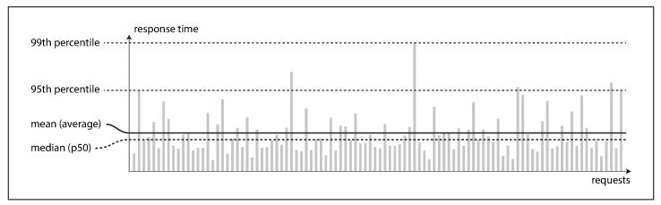
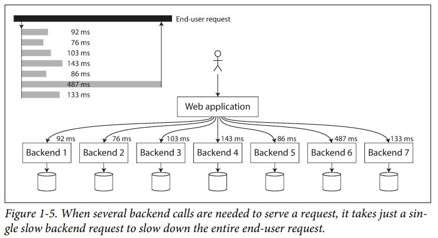

# Designing Intensive Data Applications - 1
By Toki

## Table of Contents
- [Chapter 1: Reliable, Scalable, and Maintainable Applications](#chapter-1-reliable-scalable-and-maintainable-applications)
  - [Reliability](#reliability)
  - [Scalability](#scalability)
  - [Maintainability](#maintainability)
- [Extra](#some-extra-information)
- [References](#references)

## Chapter 1: Reliable, Scalable, and Maintainable Applications

## Reliability

### 1. Imagine you need to create a _Forms Application_. What would you need to take in count to make it _reliable_?
> - The application performs the function that the user expected (a survey form)
> - It can tolerate the user making mistakes or using the software in unexpected ways (warning of input errors when puting letters into a phone number box or missing information for example)
> - Its performance is good enough for the required use case, under the expected load and data volume
> - The system prevents any unauthorized access and abuse. (The user cannot modify the survey questions or access to the information without permission)

### 2. In case of theft, how would you make your system _resilient_?
> The things that can go wrong are called faults, and systems that anticipate faults and can cope with them are called fault-tolerant or resilient.
>In this example, tolerance of that fault would require _web hosting_ / _cloud storage_

## Scalability

### 3. What's Twitter's scalability technique?
> 1. Posting a tweet simply inserts the new tweet into a global collection of tweets. When a user requests their home timeline, look up all the people they follow, find all the tweets for each of those users, and merge them (sorted by time).
> 2. Maintain a cache for each user’s home timeline—like a mailbox of tweets for each recipient user. When a user posts a tweet, look up all the people who follow that user, and insert the new tweet into each of their home timeline caches. The request to read the home timeline is then cheap, because its result has been computed ahead of time.
>
> Now that approach 2 is robustly implemented, Twitter is moving to a hybrid of both approaches. Most users’ tweets continue to be fanned out to home timelines at the time when they are posted, but a small number of users with a very large number of followers (i.e., celebrities) are excepted from this fan-out. Tweets from any celebrities that a user may follow are fetched separately and merged with that user’s home timeline when it is read, like in approach 1. This hybrid approach is able to deliver consistently good performance. 

  

### 4. You want to measure your web application performance, how would you do it?
> In online systems, what’s usually more important is the service’s _response time_—that is, the time between a client sending a request and receiving a response.
>
>Usually it is better to use percentiles. If you take your list of response times and sort it from fastest to slowest, then the median is the halfway point: for example, if your median response time is 200 ms, that means half your requests return in less than 200 ms, and half your requests take longer than that.
>
> High percentiles of response times, also known as tail latencies, are important because they directly affect users’ experience of the service. For example, Amazon describes response time requirements for internal services in terms of the 99.9th per‐ centile, even though it only affects 1 in 1,000 requests. 

  
  
  

  

### 5. If you want to prepare your web application for a fast-growing service, which strategies could you implement?
> * Vertical scaling:
>    * Moving to a more powerful machine
> * Horizontal scaling:
>    * Distributing the load across multiple smaller machines
> * Both:
>    * Tunable storage and processing costs
> * Elasticity:
>    *  Meaning that they can automatically add computing resour‐ ces when they detect a load increase, whereas other systems are scaled manually.
>
> An elastic system can be useful if load is highly unpredictable, but manually scaled sys‐ tems are simpler and may have fewer. operational surprises

## Maintainability

### 6. How can a team minimize pain during software-maintenance?
>  To this end, we will pay particular attention to three design principles for software systems:
>
> * Operability:
>    * Make it easy for operations teams to keep the system running smoothly.
> * Simplicity:
>    * Make it easy for new engineers to understand the system, by removing as much complexity as possible from the system. (Note this is not the same as simplicity of the user interface.)
> * Evolvability:
>    * Make it easy for engineers to make changes to the system in the future, adapting it for unanticipated use cases as requirements change. Also known as extensibility, modifiability, or plasticity. 

### 7. You are an Operation team member, what are you and your team responsibles for?
> * Monitoring the health of the system and quickly restoring service if it goes into a bad state
> * Tracking down the cause of problems, such as system failures or degraded per‐ formance
> * Keeping software and platforms up to date, including security patches
> * Keeping tabs on how different systems affect each other, so that a problematic change can be avoided before it causes damage
> * Anticipating future problems and solving them before they occur (e.g., capacity planning)
> * Establishing good practices and tools for deployment, configuration manage‐ ment, and more
> * Performing complex maintenance tasks, such as moving an application from one platform to another
> * Maintaining the security of the system as configuration changes are made
> * Defining processes that make operations predictable and help keep the produc‐ tion environment stable
> * Preserving the organization’s knowledge about the system, even as individual people come and go

### 8. Give an example of abstraction
>  High-level programming languages are abstractions that hide machine code, CPU registers, and syscalls. 
>
> SQL is an abstraction that hides complex on-disk and in-memory data structures, concurrent requests from other clients, and inconsistencies after crashes. 
>
> Of course, when programming in a high-level language, we are still using machine code; we are just not using it directly, because the programming language abstraction saves us from having to think about it.

## Some extra information

### 1. How do Scalability and Elasticity work in Cloud Computing?
> Virtualization is what makes scalability in cloud computing possible. Virtual machines (VMs) are scalable. They’re not like physical machines, whose resources are relatively fixed. You can add any amount of resources to VMs at any time. You can scale them up by:
> * Moving them to a server with more resources
> * Hosting them on multiple servers at once (clustering)
>
> There are usually two ways to scale a cloud solution up or down:
> * Contact the cloud provider to request it
> * Add the resources yourself via an online portal
>
> Some cloud solutions can also be auto-scaled. This means you can set them up to scale up or down automatically based on certain conditions, like when your cloud solution is running out of storage space.

### 2. Mention the benefits of Cloud Scalability
> 1. **It makes your job easier.** Don’t tell your boss about this one, but adding resources with the cloud takes less time than doing it locally with physical hardware – a lot less time. You can then spend a lot of this extra time “working.”
> 2. **It makes disaster recovery easier.** Not every business can afford a hot or cold site. But scalability allows any business to rebuild their IT in just a few hours; you just have to deploy new servers and copy over your data. It can take weeks, on the other hand, to rebuild your local IT with new physical servers.
> 3. **It gives your business incredible speed and flexibility.** Want to open a new branch? Add a new team? Start a new project or campaign? Scalability lets you add the IT resources for initiatives like this in minutes, not months.
> 4. **It lets you avoid costly, disruptive migrations.** You don’t want to deploy your IT on a platform, only to find that it can’t support you after several years of solid growth. With a scalable platform, you only migrate when you want to – not when your underlying platform lets you down.
> 5. **It saves you money. There are no large upfront costs with the cloud.** No $5,000+ servers, SANs, or networking equipment to buy. And you only pay for what you use. On a large scale, scalability reduces waste. It’s why cloud providers can offer secure, reliable business email hosting for $5 per month and still be in business.

## References
Kleppmann, M. (2017). _Designing Data Intensive Applications: Part 1. Foundations of Data Systems: Reliable, Scalable, and Maintainable Applications_. O'Reilly, 1st Edition. Pp.3-22.

IronOrbit. (2018). _Scalability In Cloud Computing_. From: https://www.ironorbit.com/blog/scalability-in-cloud-computing/
