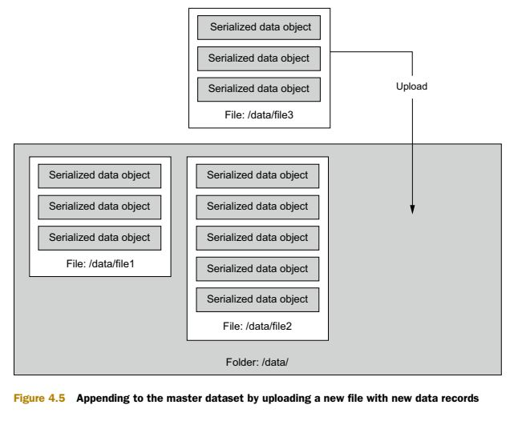
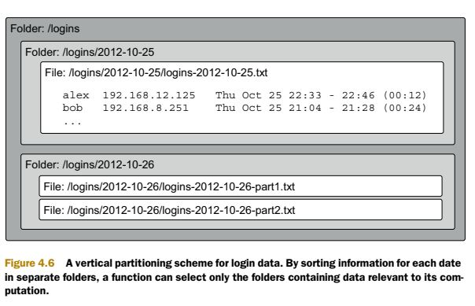

# Designing Intensive Data Applications - 1
By Toki

## Table of Contents
- [Chapter 1: Reliable, Scalable, and Maintainable Applications](#chapter-1-reliable-scalable-and-maintainable-applications)
  - [Reliability](#reliability)
- [Extra](#some-extra-information)
- [References](#references)

## Chapter 1: Reliable, Scalable, and Maintainable Applications

## Reliability

### 1. Imagine you need to create a _Forms Application_. What would you need to take in count to make it *reliable*?
> - The application performs the function that the user expected (a survey form)
> - It can tolerate the user making mistakes or using the software in unexpected ways (warning of input errors when puting letters into a phone number box or missing information for example)
> - Its performance is good enough for the required use case, under the expected load and data volume
> - The system prevents any unauthorized access and abuse. (The user cannot modify the survey questions or access to the information without permission)

### 2. What is Apache Thrift?
> It's a tool that can be used to define statically typed, `enforceable schemas`. It provides an interface definition language to describe the schema in terms of generic data types, and this description can later be used to automatically generate the actual implementation in multiple programming languages. 

### 3. Which are the workhorses of Thrift?
> The `struct` and `union` type definitions. They’re composed of other fields, such as:
> - Primitive data types (strings, integers, longs, and doubles)
> - Collections of other types (lists, maps, and sets)
> - Other structs and unions 
>
> _**Unions**_ are useful for representing nodes, _**structs**_ are natural representations of edges, and _**properties**_ use a combination of both

### 4. Which rules you must obey when evolving your schema?
> 1.  **Fields may be renamed**. This is because the serialized form of an object uses the
field IDs, not the names, to identify fields.
> 2.  **A field may be removed, but you must never reuse that field ID**. When deserializing existing data, Thrift will ignore all fields with field IDs not included in the schema. If you were to reuse a previously removed field ID, Thrift would try to deserialize that old data into the new field, which will lead to either invalid or incorrect data.
> 3.  **Only optional fields can be added to existing structs**. You can’t add required fields because existing data won’t have those fields and thus won’t be deserializable.

## Chapter 4: Data storage on the batch layer

### 1. List the storage requirements for the master dataset
> * Write:
>    * Efficient appends of new data
>    * Scalable storage
> * Read:
>    * Supportfor parallel processing
> * Both:
>    *  Tunable storage and processing costs
>    * Enforceable immutability

### 2. Describe how distributed filesystems work
> They spread their storage across a `cluster` of computers. They scale by adding more machines to the cluster. Distributed filesystems are designed so that you have fault tolerance when a machine goes down, meaning that if you lose one machine, all your files and data will still be accessible.
>
> The `operations` you can do with a distributed filesystem are often more limited than you can do with a regular filesystem. For instance, you may not be able to write to the middle of a file or even modify a file at all after creation. 

### 3. Which tool we can use to work with distributed filesystems?
> The **_Hadoop Distributed File System (HDFS)_**. Hadoop is deployed across multiple servers, typically called a cluster, and HDFS is a distributed and scalable filesystem that manages how data is stored across the cluster. 

### 4. How do you store a master dataset with a distributed filesystem?
>  With `unmodifiable files` you can’t store the entire master dataset in a single file. What you can do instead is spread the master dataset among many files, and store all those files in the same folder. Each file would contain many serialized data objects, as illustrated in figure. To `append` to the master dataset, you simply add a new file containing the new data
objects to the master dataset folder, as is shown.

  

### 5. Imagine you have a videogame application and you store your player's login information on a distributed filesystem. Each login contains a username, IP address, and timestamp. How would you apply the vertical partitioning to make your batch layer more efficient?
>  You can create a separate `folder` for each day of data. Each day folder would have many files containing the logins for that day.  By sorting information for each date in separate folders, a `function` can select only the folders containing data relevant to its computation.

  

## Some extra information

### 1. What are all the parameters that are to be considered while choosing a serialization framework?
> **1. Schema first or Code First**
>   * Generally, schema first approaches, just in case.
>   * If you have a project that'll involve different languages, code first approaches are likely to be problematic. It's all very well have a JAVA class that can be serialised, but it might be a nuisance if that has to be deserialised in C.
>
> **2.  Inter-object Demarkation**
>   * With demarkation done by the transport / store, the reader can get a batch of bytes knowing for sure that it encompasses one object, and only one object. If your message transport / data store doesn't demarkate between batches of bytes, e.g. a network stream or a file, then either you invent your own demarkation markers, or use a serialisation that demarkates for you. Examples include ASN.1 BER, XML.
>
> **3. Cannonical**
>   * This can be useful in circumstances where you're not entirely sure where the data is coming from. If the data is not cannonical, the reader has to know in advance what the object structure was otherwise the deserialisation is ambiguous. Examples of cannonical serialisations include ASN.1 BER, ASN.1 cannonical PER, XML.
>
> **4. Size and Value Constrained**
>   * Some serialisation technologies allow the developer to set constraints on the values of fields and the sizes of arrays. The intention is that code generated from a schema file incorporating such constraints will automatically validate objects on serialisation and on deserialistion.
>   * Examples include ASN.1 (usually done pretty well by tool sets), XML (not often done properly by free / cheap toolsets; MS's xsd.exe purposefully ignores any such constraints) and JSON (down to object validators). Of these three, ASN.1 has by far the most elaborate of constraints syntaxes; it's really very powerful.
>
> **5. Binary / Text**
>   * Binary serialisations will be smaller, and probably a bit quicker to serialise / deserialise. Text serialisations are more debuggable.
>
> **6. Tools cost**
>   * ASN.1 tools range from very, very expensive (and really good), to free (and less good). A lot of others are free, though I've found that the best XML tools (paying proper attention to value / size constraints) are quite expensive too.

## References
Marz, N., Warren, J. (2015). _Big Data: Principles and best practices of scalable real-time data systems_. Manning Publications Co. Pp.47-65.

StackOverflow. _Chosing serialization frameworks_. From: https://stackoverflow.com/questions/60506978/choosing-serialization-frameworks
